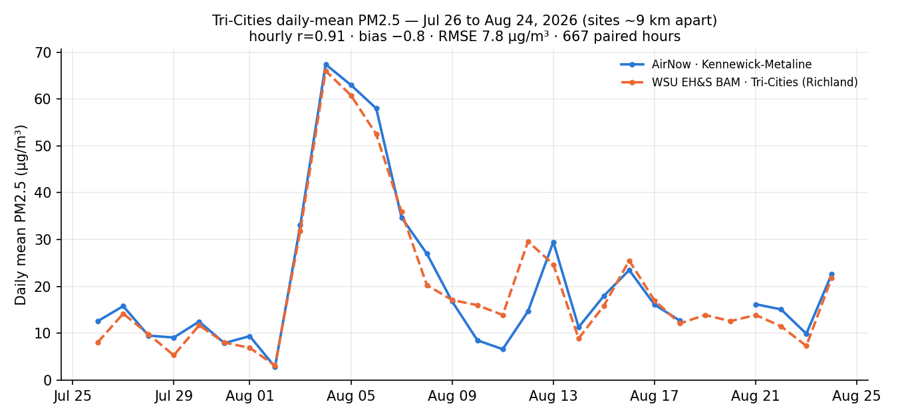
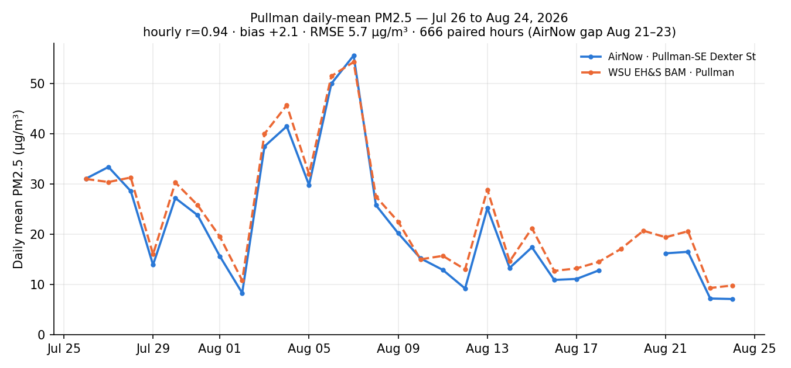
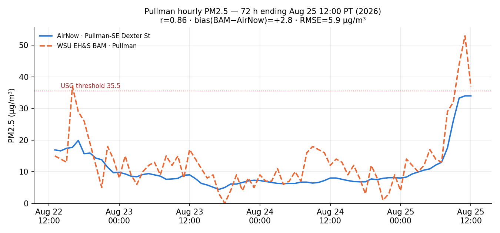

# WSU EH&S BAM vs AirNow — comparison notes (Pullman + Tri-Cities)

*2026-08-25 · Jun Meng · supporting the WSU EH&S BAM integration (prototype `/api/wsu-bam`, uncommitted)*

## Data

| | AirNow | WSU EH&S BAM |
|---|---|---|
| Site | Pullman-SE Dexter St (AQS 530750003) | "Pullman" (campus; exact coords/instrument pending EH&S) |
| Source | `data/verification/series/530750003.json` (site's own verification archive, raw AirNow hourly) | POST `airquality.wsu.edu/ajax/v1/bam/records`, `Loc_Name=Pullman&start=&end=` (PT dates → full 15-min history) |
| Values | hourly PM2.5, 0.1 µg/m³ resolution | `concHR` hourly avg, integers only at Pullman; 15-min records averaged per UTC hour |
| Separation | ~1 km (BAM coords approximate) | |

Timestamps: BAM `record` is implicit Pacific local; converted DST-safe. Zero-lag correlation was highest in a lag test (−2…+2 h), so BAM hour convention aligns with AirNow's — no shift needed in the ingest.

## 30-day comparison (Jul 26 – Aug 24 2026, PT days; n = 666 paired hours)

| Metric | Value |
|---|---|
| Mean (AirNow / BAM) | 22.2 / 24.3 µg/m³ |
| Bias (BAM − AirNow) | **+2.1 µg/m³** |
| MAE / RMSE | 4.4 / 5.7 µg/m³ |
| Correlation r | **0.944** |
| Regression (BAM on AirNow) | slope 0.97, intercept +2.8 → constant offset, not scale error |
| Max hourly (AirNow / BAM) | 82.7 / 87 µg/m³ (early-Aug smoke episode) |
| Coverage | BAM 719/720 h; AirNow ~54 h missing (incl. ~2-day gap Aug 21–23) |

### USG threshold agreement (hourly ≥ 35.5 µg/m³)

| | count |
|---|---|
| Both ≥ USG | 81 h |
| BAM only | 39 h |
| AirNow only | 5 h |

The ~+2 µg/m³ offset makes the BAM cross the L&I Wildfire Smoke Rule / USG line ~50% more often. Matches the 2026-08-25 event: EH&S advisory at 35.5 µg/m³ / AQI 101 while AirNow peaked ~34.

## 72-h event window (Aug 22 13:00 – Aug 25 12:00 PT)

r = 0.86, bias +2.8, RMSE 5.9 µg/m³. During the smoke ramp Aug 24 evening the BAM peaked at 53 vs AirNow 33–34. BAM is visibly noisier hour-to-hour at low concentrations (integer reporting + typical BAM ±2–3 µg/m³ hourly noise); AirNow curve is smooth.

## Tri-Cities: BAM vs Kennewick-Metaline (same 30 days)

Nearest AirNow neighbor to the WSU Tri-Cities BAM (Richland campus) is **Kennewick-Metaline** (AQS 530050002), **~9 km away** — a real spatial separation, unlike the ~1 km Pullman pair. (Kennewick-S Steptoe was rejected: only 480/1416 h coverage.)

| Metric | Value |
|---|---|
| n paired hours | 667 (BAM 720/720; AirNow has the same Aug 21–23 gap) |
| Mean (AirNow / BAM) | 20.9 / 20.1 µg/m³ |
| Bias (BAM − AirNow) | **−0.8 µg/m³** (essentially none) |
| MAE / RMSE | 5.3 / 7.8 µg/m³ |
| Correlation r | 0.914 |
| Regression | slope 0.90, intercept +1.3 |
| Max hourly | 99.2 / 107.1 µg/m³ (early-Aug episode) |
| USG hours (≥35.5) | both 108 · BAM-only 16 · AirNow-only 18 — **balanced**, unlike Pullman |

Contrast with Pullman: no systematic offset, and threshold exceedances are symmetric — the differences here look like real ~9-km spatial gradient during plume events (larger RMSE, day-scale divergences around the mid-Aug episode, e.g. Aug 11–13) rather than an instrument offset. This weakens a pure-instrument explanation for the Pullman +2 µg/m³ bias and points at siting/local gradient — worth raising with EH&S.

## Conclusions

- The two records are highly consistent (r 0.94, slope ~1) — the BAM is credible and adds a second, independent Pullman measurement.
- Systematic +2–3 µg/m³ BAM offset; decisive near the 35.5 µg/m³ USG threshold, likely why EH&S advisories can fire when the AirNow site sits just below.
- BAM had better uptime this month and would have kept the Pullman dot alive through AirNow's Aug 21–23 outage.
- Keep the sites separate in the viewer and in per-site verification stats (prototype already does).
- Caveats: raw (not QC'd) AirNow hourly; Pullman BAM feed integer-valued; BAM coords approximate; cause of offset (siting vs instrument vs gradient) not attributable from one month.

## Plots

## Repro

- BAM hourly means: fetch upstream with `start`/`end` PT dates, tolerant-parse `concHR` (`+000037` vs `+00021.4`), clamp negatives, average 15-min records per UTC hour (same logic as `pipeline/functions/api/wsu-bam.js` series mode).
- AirNow: `pm.o` array from the deployed verification series JSON (starts at PT midnight of its `start` date).
- Stats: plain mean/RMSE/Pearson on paired non-null hours; daily means require ≥18 of 24 h.
